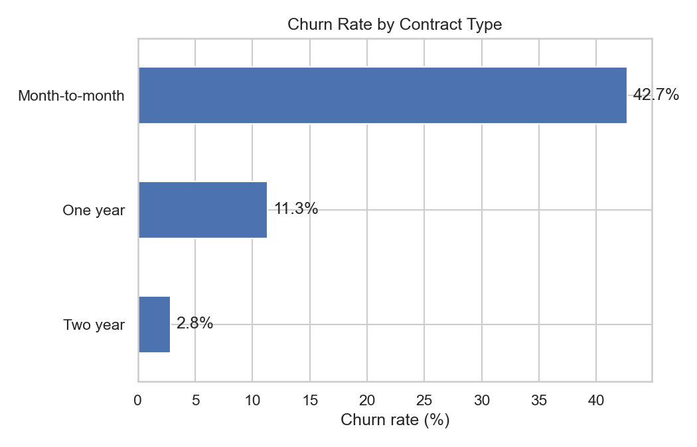
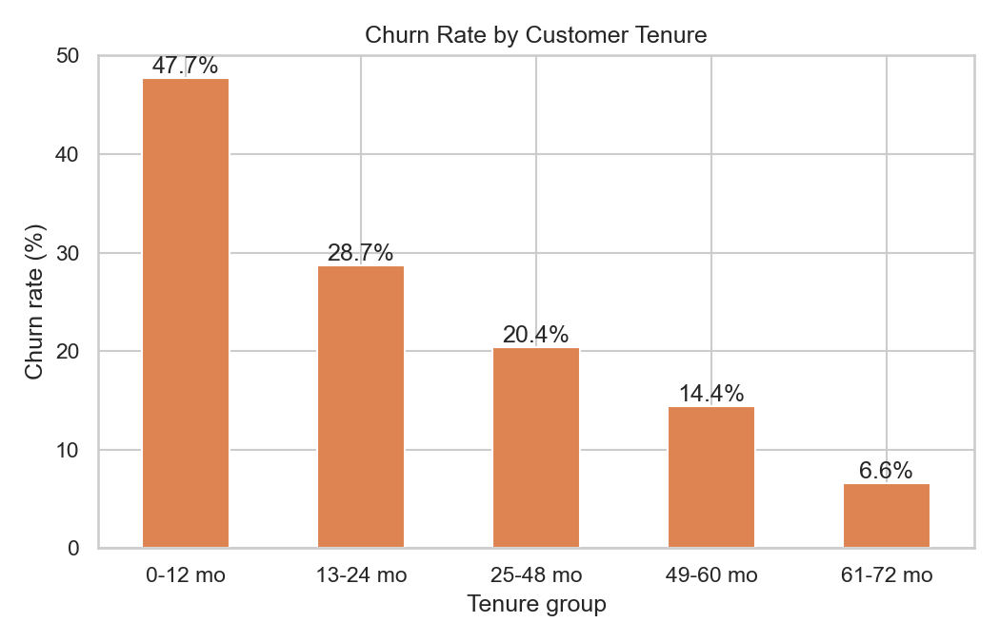
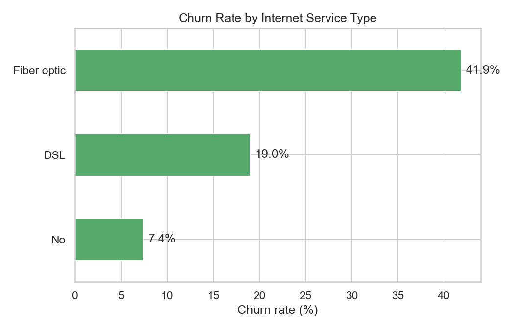
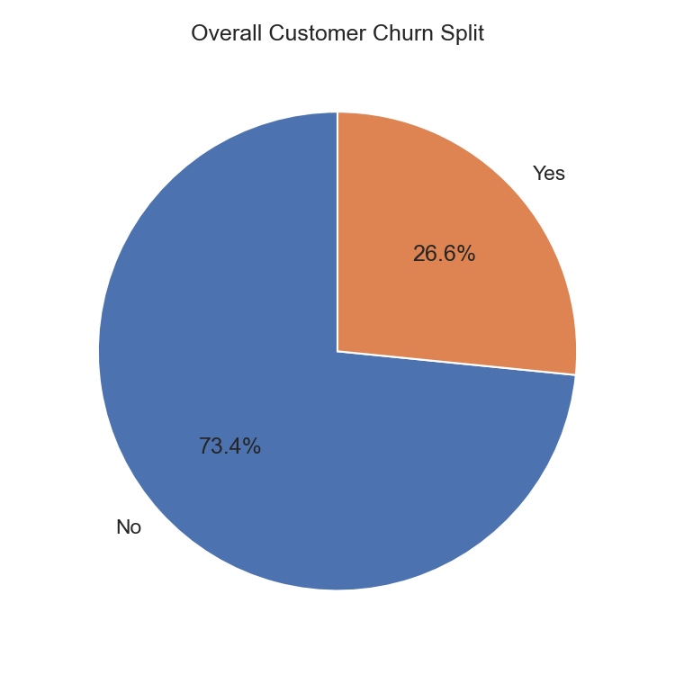
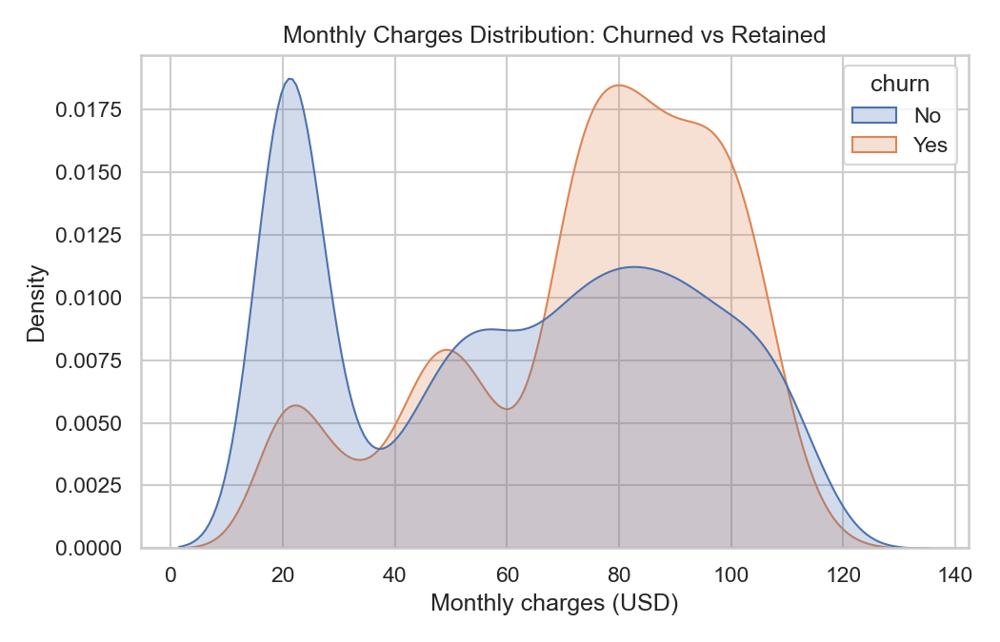

# Telco Customer Churn Analysis

End-to-end customer churn analysis for a telecom provider — data cleaning, SQL/Python exploratory analysis, and a dashboard specification, built to identify which customers are most likely to churn and why.

## Business problem

Customer churn directly erodes recurring revenue, and acquiring a new customer typically costs far more than retaining an existing one. This project analyzes 7,000+ telecom customer records to answer three questions a retention team would actually ask:

1. What is our overall churn rate, and how much monthly revenue is at risk?
2. Which customer segments (contract type, tenure, service type, support level) churn the most?
3. What retention actions would have the highest impact?

## Objectives

- Clean and validate a real-world customer dataset for analysis.
- Quantify churn rate overall and by key segments using SQL and Python.
- Visualize churn drivers to make findings accessible to non-technical stakeholders.
- Translate findings into concrete, prioritized business recommendations.
- Specify a dashboard layout for ongoing self-service monitoring.

## Dataset

- **Source:** [IBM Telco Customer Churn dataset](https://github.com/IBM/telco-customer-churn-on-icp4d) (public, widely used for churn analysis portfolios/tutorials).
- **Size:** 7,043 customers, 21 columns (raw) → 7,032 customers after cleaning.
- **Grain:** one row per customer.
- **Fields:** demographics (gender, senior citizen, partner, dependents), account info (tenure, contract, payment method, charges), subscribed services (phone, internet, streaming, security, tech support), and the churn label.
- Full field-level documentation: [`docs/data_dictionary.md`](docs/data_dictionary.md).

## Tools & technologies

| Category | Tools |
|---|---|
| Data cleaning & analysis | Python, pandas, numpy |
| Visualization | matplotlib, seaborn |
| Querying | SQL (PostgreSQL/SQLite-compatible) |
| Dashboarding | Power BI / Tableau (see [dashboard spec](dashboard/dashboard_spec.md)) |
| Environment | Jupyter Notebook |
| Version control | Git / GitHub |

## Project workflow

```
Raw CSV export
      |
      v
scripts/data_cleaning.py  -->  data/processed/telco_customer_churn_clean.csv
      |
      +--> notebooks/01_data_cleaning.ipynb   (documents cleaning decisions)
      |
      +--> sql/01_schema.sql, sql/02_churn_analysis_queries.sql
      |
      +--> scripts/eda_report.py  -->  images/*.png, reports/kpi_summary.json
              |
              +--> notebooks/02_exploratory_data_analysis.ipynb
              |
              +--> reports/key_findings.md  (findings + recommendations)
              |
              +--> dashboard/dashboard_spec.md  (Power BI / Tableau build spec)
```

## Data cleaning steps

1. **Standardized column names** to snake_case for consistency across Python and SQL.
2. **Fixed `TotalCharges` typing** — it ships as text in the raw export because 11 brand-new customers (`tenure = 0`) have a blank value instead of `0`. These 11 rows (0.16% of the data) were dropped rather than imputed, since there's no reliable way to infer a first bill.
3. **Standardized `SeniorCitizen`** from `0`/`1` to `Yes`/`No` to match every other flag column.
4. **Derived `churn_flag`** (0/1) for aggregation and `tenure_group` (5 buckets) for cohort analysis.

Full logic: [`scripts/data_cleaning.py`](scripts/data_cleaning.py) · walkthrough: [`notebooks/01_data_cleaning.ipynb`](notebooks/01_data_cleaning.ipynb).

## Exploratory data analysis summary

Computed on the cleaned dataset (7,032 customers) via [`scripts/eda_report.py`](scripts/eda_report.py) and cross-checked with [`sql/02_churn_analysis_queries.sql`](sql/02_churn_analysis_queries.sql):

| Metric | Value |
|---|---|
| Overall churn rate | **26.6%** |
| Monthly revenue at risk (churned customers) | **$139,131** |
| Avg. monthly charges | $64.80 |
| Avg. customer tenure | 32.4 months |
| Churn rate — month-to-month contracts | **42.7%** |
| Churn rate — two-year contracts | **2.8%** |
| Churn rate — fiber optic internet | **41.9%** |
| Churn rate — DSL internet | 19.0% |
| Churn rate — no tech support | **41.6%** |
| Churn rate — with tech support | 15.2% |

Full JSON output: [`reports/kpi_summary.json`](reports/kpi_summary.json).

## Key insights / findings

1. **Contract type is the strongest churn signal.** Month-to-month customers churn at ~15x the rate of two-year contract customers.
2. **Early tenure is the highest-risk period.** Churn is concentrated in a customer's first 12 months and declines steadily after that.
3. **Fiber optic customers churn more than DSL customers** (41.9% vs 19.0%), despite fiber being the premium product — suggesting a service-quality or price-sensitivity issue worth investigating.
4. **Tech support meaningfully reduces churn.** Customers without it churn at ~2.7x the rate of those with it.
5. **Highest-risk segment:** month-to-month, fiber-optic customers — the priority target for retention offers.

Full write-up with business recommendations: [`reports/key_findings.md`](reports/key_findings.md).

## SQL analysis summary

[`sql/02_churn_analysis_queries.sql`](sql/02_churn_analysis_queries.sql) contains 9 queries against the `customer_churn` table (schema: [`sql/01_schema.sql`](sql/01_schema.sql)), covering: overall churn rate, churn by contract/internet service/tenure group/payment method, tech support impact, charge comparisons between churned and retained customers, top-5 highest-risk segments, and total revenue at risk. All queries were validated against the cleaned dataset (see workflow notes) and are SQLite/PostgreSQL/MySQL compatible.

## Dashboard overview

No interactive dashboard file is bundled in this repo (a `.pbix`/`.twbx` is a poor fit for Git version control). Instead, [`dashboard/dashboard_spec.md`](dashboard/dashboard_spec.md) is a complete build spec — page layout, required visuals, fields, and suggested DAX measures — for recreating the dashboard in Power BI or Tableau directly from `data/processed/telco_customer_churn_clean.csv`. Static equivalents of the core visuals are in [`images/`](images/) (see Screenshots below).

## Folder structure

```
telco-customer-churn-analysis/
├── README.md
├── requirements.txt
├── .gitignore
├── LICENSE
├── data/
│   ├── raw/                  # original export, untouched
│   └── processed/            # cleaned, analysis-ready CSV
├── notebooks/
│   ├── 01_data_cleaning.ipynb
│   └── 02_exploratory_data_analysis.ipynb
├── sql/
│   ├── 01_schema.sql
│   └── 02_churn_analysis_queries.sql
├── scripts/
│   ├── data_cleaning.py      # reusable cleaning pipeline
│   └── eda_report.py         # KPI + chart generation
├── dashboard/
│   └── dashboard_spec.md     # Power BI / Tableau build spec
├── reports/
│   ├── kpi_summary.json
│   └── key_findings.md
├── images/                   # generated chart PNGs
└── docs/
    └── data_dictionary.md
```

## How to run this project locally

```bash
# 1. Clone the repo
git clone https://github.com/Bagi4044/Data-Analytics-.git
cd Data-Analytics-

# 2. Create a virtual environment and install dependencies
python -m venv venv
source venv/bin/activate      # Windows: venv\Scripts\activate
pip install -r requirements.txt

# 3. Run the cleaning pipeline
python scripts/data_cleaning.py

# 4. Generate KPIs and charts
python scripts/eda_report.py

# 5. (Optional) Explore interactively
jupyter notebook notebooks/
```

All scripts use paths relative to the project root, so they run unmodified on any machine.

## Results & business recommendations

- **Incentivize contract upgrades** for month-to-month, fiber-optic customers in their first 12 months — this is the highest-leverage segment for retention offers.
- **Bundle tech support into fiber plans**, at least for the first year, to offset fiber's elevated churn rate.
- **Build a first-90-days retention track** (onboarding check-ins, proactive outreach), since churn risk is heavily front-loaded.
- **Audit fiber pricing and service quality** relative to DSL, since the churn gap points to a product-experience issue rather than just contract flexibility.

## Screenshots

| Churn by Contract Type | Churn by Tenure |
|---|---|
|  |  |

| Churn by Internet Service | Overall Churn Split |
|---|---|
|  |  |

| Monthly Charges Distribution |
|---|
|  |

## Resume Highlights

- Built an end-to-end churn analysis pipeline (Python + SQL) on 7,000+ customer records, identifying a 26.6% churn rate and $139K/month in at-risk revenue.
- Diagnosed key churn drivers — contract type, tenure, service type, and support coverage — through EDA and SQL segmentation, surfacing a 15x churn-rate gap between month-to-month and two-year contract customers.
- Designed a reusable, modular data cleaning pipeline (`scripts/data_cleaning.py`) with documented, tenure-based justification for handling missing billing data.
- Authored 9 production-style SQL queries for churn segmentation and revenue-at-risk reporting, validated against the cleaned dataset.
- Translated analytical findings into 4 prioritized, actionable retention recommendations for a hypothetical stakeholder team.
- Specified a 3-page Power BI/Tableau dashboard (KPIs, churn drivers, customer explorer) ready for direct implementation from the processed dataset.

## Skills demonstrated

`SQL` `Python` `pandas` `data cleaning` `exploratory data analysis` `data visualization` `KPI analysis` `trend analysis` `dashboard design` `business reporting` `technical documentation` `Git / version control`

## Future improvements

- Build the actual Power BI/Tableau dashboard from the spec and publish screenshots/a public link.
- Add a churn-prediction model (e.g., logistic regression or gradient boosting) with feature importance to complement the descriptive analysis.
- Set up a lightweight ETL (e.g., Airflow or a scheduled script) if this were connected to a live data source instead of a static export.
- Add unit tests for the cleaning pipeline (`pytest`) to guard against upstream schema drift.

## License

This project is licensed under the [MIT License](LICENSE). The dataset is the publicly available IBM Telco Customer Churn sample dataset, used here for educational/portfolio purposes.
